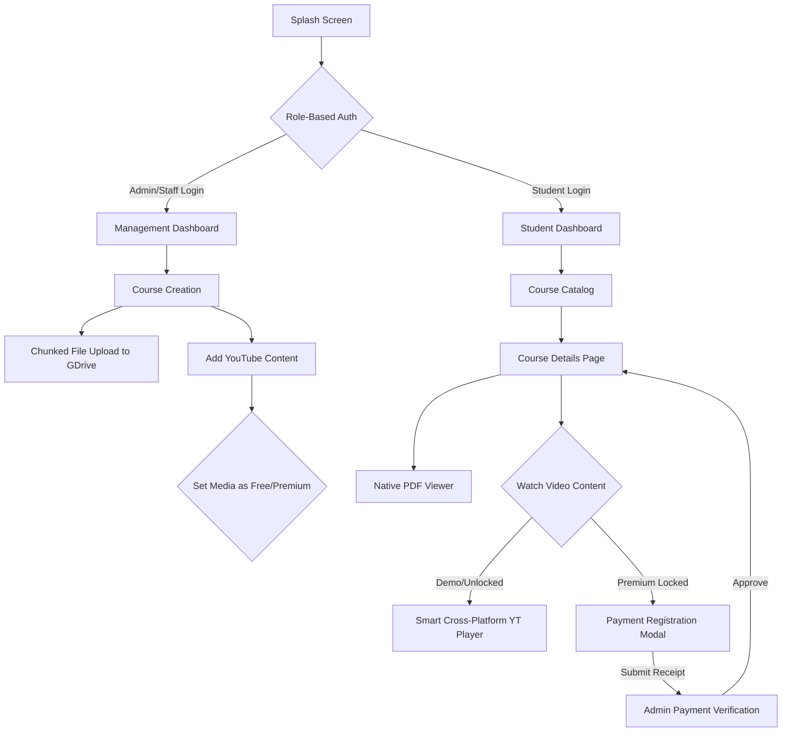

# 🌿 Vaagai App (வாகை)

<div align="center">
  
  
  
  
</div>

---

### 🔥 **Overview**
**Vaagai** is a premium, state-of-the-art educational application designed to bridge the gap between quality content creation and immersive student learning. Built with a focus on cross-platform high-performance architecture and modern design aesthetics, Vaagai provides a seamless platform for academy administrators, staff, and eager learners.

---

### 🎨 **Key Features & Capabilities**

#### 👨‍🏫 **For Staff & Admins (Management Module)**
- **Role-Based Access Control**: Secure login flows specifically tailored for Students, Staff, and Admins.
- **Dynamic Course Management**: Real-time updates for titles, descriptions, and instructors via an intuitive CMS.
- **Advanced Document Uploads**: Features a custom-built Google Apps Script proxy that bypasses traditional Google Drive POST limits, allowing for chunked uploads of large syllabus PDFs and high-res course images directly to organization drives.
- **Video Strategy**: Effortlessly add YouTube content with full URL-agnostic parsing (supports mobile, shorts, and standard links).
- **Payment & Content Gating**: Admins can verify offline payments/receipts to safely unlock Premium course content for specific student accounts.

#### 🎓 **For Students**
- **Adaptive In-App Theater**: Watch YouTube lessons natively. The app dynamically switches between `youtube_player_iframe` for the Web and `youtube_player_flutter` (native WebView bindings) on Mobile for an unbreakable, error-free playback experience.
- **Native PDF Rendering**: High-fidelity PDF document viewer built directly into the dashboard using Syncfusion.
- **Progressive Discovery**: Browse professional course cards with clear status indicators, locked/unlocked states, and visually engaging demo previews.
- **Unified Hub**: Access all materials, videos, and instructor info in one centralized, glassmorphism-styled dashboard.

---

### 🛠️ **System Architecture & Tech Stack**
The project utilizes the **Provider** pattern customized into a clean, scalable architecture separating UI views, internal services, and state models.

- **Frontend/UI**: Flutter (Material 3) with custom Glassmorphism components.
- **Backend & State**: Firebase (Firestore, Authentication) serving as the primary NoSQL datastore and real-time state synchronizer.
- **Storage/File Delivery**: 
  - **DriveUtils Engine**: A centralized URL-transformer that takes raw Drive IDs or obscure drive links and converts them on-the-fly into direct `uc?export=download` and `uc?export=view` endpoints. 
  - **Proxy Server**: Google Apps Script acts as the intermediary chunked-upload server.
- **Media Engines**: `youtube_player_flutter` (Mobile), `youtube_player_iframe` (Web), `syncfusion_flutter_pdfviewer` (Documents).

---

### 📐 **Application Flow**



---

### 🚀 **Installation & Local Setup**

1. **Clone the repository**
   ```bash
   git clone https://github.com/Vinothkumar0311/Vaagai_app.git
   cd vaagai
   ```

2. **Install dependencies**
   ```bash
   flutter pub get
   ```

3. **Firebase & Google Services Configuration**
   - Place your Android `google-services.json` inside `android/app/`.
   - Place your Web Firebase config inside `web/index.html`.
   - Configure your Google Apps Script Web App URL inside the `DriveUploadService` singleton.

4. **Run the App**
   - **For Mobile (Android/iOS):**
     ```bash
     flutter run
     ```
   - **For Web Browser:**
     ```bash
     flutter run -d chrome
     ```

---

### 📸 **Previews & UI (Coming Soon)**
*(Screenshots of the Dashboard, Video Player, and Course Management can be placed here)*

---

<div align="center">
  <p>Built with ❤️ by Vinothkumar0311 for the Vaagai Community</p>
  <sub>Premium Learning. Simplified.</sub>
</div>
