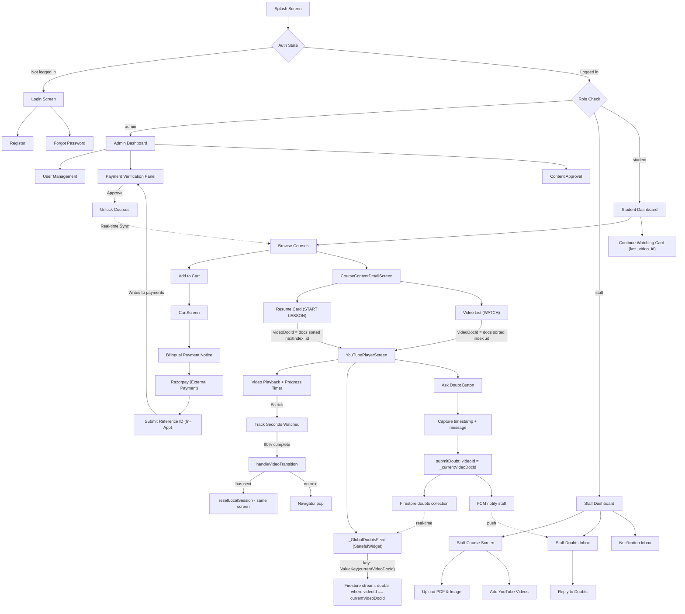

# 🌿 Vaagai App (வாகை)

<div align="center">
  
  
  
  
  
</div>

---

## 🔥 Overview

**Vaagai** is a premium cross-platform educational application built with Flutter + Firebase. It enables staff to create and manage video-based courses, and students to watch lessons, track progress, and interact with instructors through an async doubt system. The app features a secure **Razorpay-integrated** checkout flow for course access.

The architecture uses the **Provider** pattern for state management, **Firestore** as the real-time backend, and a strict separation between UI views, providers, services, and data models. It is built for **real-time synchronization**, ensuring data is always live without page reloads.

---

## 🗂️ Project Structure

```
lib/
├── core/
│   ├── constants/          # App strings, colors, theme tokens
│   ├── models/             # Pure data models (Firestore ↔ Dart)
│   │   ├── course_progress_model.dart
│   │   ├── doubt_model.dart
│   │   └── uploaded_document.dart
│   └── utils/
│       └── drive_utils.dart   # Google Drive URL transformer
│
├── providers/              # All ChangeNotifier providers (state layer)
│   ├── auth_provider.dart
│   ├── course_access_provider.dart
│   ├── course_provider.dart
│   ├── doubt_provider.dart
│   ├── notification_provider.dart
│   └── progress_provider.dart
│
├── services/
│   ├── notification_service.dart   # FCM push notification dispatcher
│   └── ...
│
├── view/
│   ├── screens/            # All UI screens (one per feature)
│   └── widgets/            # Reusable UI components
│
├── firebase_options.dart
├── main.dart
└── splash_screen.dart
```

---

## 🧩 Firestore Data Structure

### `users` collection
```
users/{uid}
  ├── name: String
  ├── email: String
  ├── role: "student" | "staff" | "admin"
  ├── fcmToken: String          # For push notifications
  └── courses: List<String>     # Unlocked course IDs
```

### `course_uploads` collection
```
course_uploads/{courseDocId}
  ├── title: String
  ├── objective: String
  ├── trainers: String
  ├── imageUrl: String          # Google Drive file URL
  ├── pdfUrl: String?           # Optional syllabus
  ├── createdBy: String         # Staff UID (used for doubt notifications)
  └── status: "approved" | "pending"
```

### `course_videos` collection
```
course_videos/{videoDocId}
  ├── courseDocId: String       # FK → course_uploads
  ├── title: String
  ├── youtubeUrl: String
  ├── isDemo: Boolean
  ├── status: "approved" | "pending"
  └── createdAt: Timestamp      # CRITICAL: Used for chronological sort order
```

> ⚠️ **IMPORTANT**: `createdAt` is the **only** source of truth for video order.
> Always sort `course_videos` by `createdAt` ascending before indexing.
> **Never** use the raw Firestore snapshot order (it is non-deterministic).

### `course_progress` collection
```
course_progress/{docId}
  ├── student_id: String
  ├── course_id: String
  ├── completed_videos: List<String>    # List of completed videoDocIds
  ├── completed_videos_count: int
  ├── last_video_id: String             # Current/next video pointer
  ├── last_timestamp: int               # Resume position in seconds
  ├── progress_percentage: double
  ├── total_videos: int
  └── updated_at: Timestamp
```

> ⚠️ **RULE**: `last_video_id` points to the **currently-playing** or **next-to-watch** video.
> After a video is 90% complete, it is advanced to the next video's ID.
> The periodic sync (every 5s) must **NOT** overwrite `last_video_id` if the current
> video is already in `completed_videos` — doing so would regress the pointer.

### `doubts` collection
```
doubts/{doubtDocId}
  ├── studentId: String
  ├── studentName: String
  ├── courseId: String
  ├── courseName: String
  ├── courseImage: String?
  ├── videoId: String         # ← MUST be the Firestore videoDocId (NOT the YouTube video ID)
  ├── videoTitle: String
  ├── timestampSeconds: int   # Exact second in the video when doubt was submitted
  ├── message: String
  ├── staffReply: String?
  ├── status: "pending" | "replied" | "closed"
  ├── createdAt: Timestamp
  └── repliedAt: Timestamp?
```

> ⚠️ **CRITICAL**: `videoId` in doubts must always equal the Firestore `course_videos`
> document ID — **not** the YouTube video ID string (e.g. `dQw4w9WgXcQ`).

### `payments` collection (Razorpay Integration)
```
payments/{paymentDocId}
  ├── userId: String
  ├── userName: String
  ├── userEmail: String
  ├── courseIds: List<String>
  ├── courseItems: List<Map>      # {courseId, courseTitle}
  ├── amount: int                 # In INR
  ├── status: "pending" | "verification_pending" | "success" | "failed"
  ├── paymentLink: String         # Hosted Razorpay link
  ├── submittedPaymentRef: String # Student-provided Reference ID
  ├── verifiedBy: String?         # Admin UID
  ├── createdAt: Timestamp
  └── updatedAt: Timestamp
```

### `course_access` collection
```
course_access/{accessDocId}
  ├── studentId: String
  ├── courseId: String
  ├── courseTitle: String
  ├── paymentStatus: "pending" | "approved" | "rejected"
  ├── accessEnabled: Boolean
  ├── paymentProofUrl: String?    # Link to verification screenshot
  ├── approvedBy: String?         # Admin UID
  ├── rejectionReason: String?
  └── createdAt: Timestamp
```

### `notifications` collection
```
notifications/{notifId}
  ├── recipientUid: String
  ├── title: String
  ├── body: String
  ├── doubtId: String
  ├── is_read: Boolean
  └── createdAt: Timestamp
```

---

## 🎯 Role-Based Access Flow

```
Splash Screen
    │
    ▼
AuthProvider checks Firebase Auth state
    │
    ├─── Not logged in ──► Login Screen ──► Register / Forgot Password
    │
    └─── Logged in ──► Role check from Firestore users/{uid}.role
               │
               ├─── "admin"   ──► AdminDashboardScreen
               ├─── "staff"   ──► StaffDashboardScreen
               └─── "student" ──► StudentDashboardScreen
```

---

## 🎓 Student Learning Flow (Core)

```
StudentDashboardScreen
    │
    ├── "Continue Watching" card
    │       └── Reads last_video_id from ProgressProvider.myProgress
    │               └── Navigates to YouTubePlayerScreen with correct videoDocId + startAt timestamp
    │
    └── Browse Courses ──► Add to Cart (CartProvider) ──► CartScreen
            │
            └── Request Unlock (Checkout) ──► PaymentProvider (Razorpay) ──► Admin Approval
```

### CourseContentDetailScreen Flow

```
CourseContentDetailScreen
    │
    ├── Consumer<ProgressProvider>
    │       └── Reads progress.lastVideoId  →  finds nextIndex in SORTED docs list
    │
    ├── StreamBuilder on `course_videos`
    │       └── Fetches all approved videos for this course
    │               └── Sorted by createdAt ASC → docs[0] = Chapter 1, docs[1] = Chapter 2...
    │
    ├── Resume Card ("START LESSON")
    │       └── videoDocId = docs[nextIndex].id   ← ✅ always from SORTED list
    │               └── _handleVideoTap() → Navigator.push(YouTubePlayerScreen)
    │
    └── Video List (ListView.builder iterates sorted `docs`)
            └── WATCH button
                    └── videoDocId = docs[index].id   ← ✅ always from SORTED list
                            └── _handleVideoTap() → Navigator.push(YouTubePlayerScreen)
```

> ⚠️ **GOLDEN RULE**: Both "START LESSON" and "WATCH" must pass `docs[index].id`
> from the **chronologically sorted** list. Using `snapshot.data!.docs[index].id`
> (unsorted) causes wrong `videoId` to be passed and breaks doubt synchronization.

---

## 🎬 YouTubePlayerScreen Flow

```
YouTubePlayerScreen(videoUrl, title, courseId, videoDocId, ...)
    │
    initState()
    ├── _currentVideoDocId = widget.videoDocId
    ├── _extractVideoId()      ← extracts YouTube video ID from URL
    ├── _initFlutterController() / _initIframeController()
    └── _startProgressSync()   ← starts 5s Timer
            │
            ├── Every 5 seconds:
            │       ├── trackPlayedSecond()     ← records seconds watched
            │       ├── saveProgressLocally()   ← SharedPreferences cache
            │       ├── Check 90% completion
            │       │       └── if complete → _handleVideoTransition()
            │       └── Every 2 min → _triggerCloudSync()
            │
_handleVideoTransition()
    ├── Cancel timer
    ├── _findNextVideo()        ← queries sorted course_videos, finds next after _currentVideoDocId
    ├── _triggerCloudSync(forceComplete: true, nextVideoId: next.id)
    │       └── syncProgressToCloud() → writes completed_videos, advances last_video_id
    └── nextVideo != null
            ├── _resetLocalSession(nextVideoId, nextTitle, nextUrl)
            │       ├── setState { _currentVideoDocId = newId, _currentTitle, _currentUrl }
            │       ├── _extractVideoId()
            │       ├── _loadVideoInPlayer()   ← loads new video in same player
            │       └── _startProgressSync()  ← fresh timer for new video
            └── else → Navigator.pop()  (all videos done)
```

### Doubt Feed (\_GlobalDoubtsFeed) — StatefulWidget

```
_GlobalDoubtsFeed(key: ValueKey(_currentVideoDocId), videoId: _currentVideoDocId)
    │
    initState()
    └── _doubtStream = FirebaseFirestore
            .collection('doubts')
            .where('videoId', isEqualTo: widget.videoId)
            .snapshots()
            .map(...)

    didUpdateWidget()
    └── if videoId changed → rebuild _doubtStream   ← belt-and-suspenders

    build()
    └── StreamBuilder(stream: _doubtStream)
            ├── waiting  → CircularProgressIndicator
            ├── empty    → "சந்தேகங்கள் எதுவும் இல்லை"
            └── data     → ListView of _DoubtThreadWidget
```

> ✅ **KEY**: `key: ValueKey(_currentVideoDocId)` on the parent forces Flutter to
> **destroy and recreate** `_GlobalDoubtsFeed` entirely on every video switch.
> This guarantees the Firestore stream is always bound to the current video —
> never reused from a previous video session.

---

## 💬 Doubt Submission Flow

```
Student inside YouTubePlayerScreen
    │
    ├── Taps "சந்தேகம் கேட்க (Ask a Doubt)"
    │
    ├── _showAskDoubtModal()
    │       ├── Captures current video timestamp (from player controller)
    │       └── Shows BottomSheet with TextField
    │
    └── On Submit → DoubtProvider.submitDoubt()
            ├── Writes to `doubts` collection:
            │       videoId: _currentVideoDocId   ← Firestore doc ID, NOT YouTube ID
            │       timestampSeconds: <current player position>
            │       message: <student text>
            │
            └── Notifies staff via NotificationService.sendNotification()
                    └── Looks up course.createdBy → sends FCM push to that staff UID
```

---

## 📊 Progress Tracking Logic

### 90% Completion Rule

The app uses **unique-seconds tracking** to prevent skipping to the end to mark completion:

```dart
// Every 5 seconds, record the last 5 seconds as "watched"
progressProvider.trackPlayedSecond(videoDocId, currentPosition);

// Completion check (either method passes):
bool isTrulyCompleted = (watchedUniqueSeconds / totalDuration) >= 0.9;
bool durationReached  = (currentPosition   / totalDuration) >= 0.95;
```

### Cloud Sync Rules

| Condition | `last_video_id` written | `last_timestamp` written |
|-----------|------------------------|--------------------------|
| Video in progress (not completed) | current `videoDocId` | current position |
| Video already in `completed_videos` (re-watching) | **NOT updated** ✅ | **NOT updated** ✅ |
| Video just completed (90% rule) | **next video's docId** | `0` (reset) |
| No next video after completion | current `videoDocId` | current position |

> ⚠️ **BUG TO PREVENT**: If a student re-watches a completed video, the periodic
> sync must **not** overwrite `last_video_id` back to the re-watched video.
> That would erase the progress pointer that was already advanced to the next video.
> Always check `completed.contains(videoId)` before writing `last_video_id`.

### Student Enrollment Flow (Cart System)

The app uses a cart-based system for course access requests to allow students to select multiple courses and request unlocking in a single batch.

1.  **Course Selection**: From the `StudentDashboardScreen`, students can add locked courses to their cart.
2.  **Review & Edit**: The `CartScreen` allows students to review their selections and remove items.
3.  **Bilingual Pre-Payment Notice**: Tapping "REQUEST UNLOCK" triggers a bilingual (Tamil/English) popup reminding the student to capture their **Payment ID** after the transaction.
4.  **Razorpay Integration**: Students are redirected to a hosted Razorpay payment link.
5.  **Manual Proof Submission**: After payment, students enter their Razorpay Reference ID into the app for verification.
6.  **Admin Approval**: Once the admin verifies the Reference ID in the `payments` collection, the student's access is enabled across all selected courses.

---

## 🔔 Notification Flow

```
Student submits doubt
    │
    DoubtProvider.submitDoubt()
    └── writes to `doubts` collection
    └── fetches course_uploads/{courseId} → gets createdBy (staff UID)
    └── NotificationService.sendNotification(recipientUid: staffUID, ...)
            └── reads FCM token from users/{staffUID}.fcmToken
            └── POST to FCM API → push notification to staff device

Staff receives notification
    └── Taps notification → navigates to DoubtChatScreen(doubtId)
    └── Staff types reply → DoubtProvider.replyToDoubt()
            └── updates doubts/{doubtId}.staffReply + status="replied"
            └── Student sees reply in StudentDoubtsScreen (real-time stream)
```

---

---

## ⚡ Reactive Architecture & Real-Time Sync

The application has been modernized from a "Fetch-on-Load" pattern to a **Fully Reactive (Stream-Based)** architecture. This ensures that the UI always mirrors the source of truth in Firestore without requiring manual refreshes or page reloads.

### 🔄 Real-Time Dashboard Synchronization
*   **Staff Dashboard**: Now uses `StreamBuilder` on `course_uploads`. When a staff member publishes a new course via `DocumentUploadScreen`, it appears instantly in their "My Courses" list.
*   **Student Dashboard**: Built with snapshots to show newly approved courses the moment they are greenlit by admins.
*   **Access & Progress Streams**: `CourseAccessProvider` and `ProgressProvider` maintain live Firestore subscriptions. When an admin approves a payment, the "LOCK" icon on the course card transforms into "WATCH" instantly without a refresh.
*   **Auto-Updating Stats**: Analytical cards and dashboard counters (e.g., course count, unread notifications) are bound to live Firestore counts, ensuring accuracy as data changes in the background.

### 💳 Secure Razorpay Payment Flow
The payment system is designed for high reliability and manual/automated hybrid verification:
*   **Pre-Check**: Validates the student's cart before generating a payment request.
*   **Idempotency**: Creates a "pending" payment record in Firestore *before* redirection to prevent lost transactions.
*   **Bilingual UX**: Instructions provided in both Tamil and English to ensure students from all backgrounds understand the requirement to capture the Reference ID.
*   **Proof Tracking**: Records the exact Reference ID and ties it to multiple course IDs, allowing for bulk approvals.

### 📊 Live Analytics System
The **Analytics System** provides instructors with real-time insights into student engagement:
*   **Course Discovery**: The `AnalyticsCourseListScreen` uses reactive streams to show the latest course catalog.
*   **Live Progress Tracking**: `CourseAnalyticsCard` tracks student progress as it happens. Instructors can see:
    *   **Average Progress**: Live mean completion across all enrolled students.
    *   **Engagement Distribution**: Real-time breakdown of students in different learning stages (0-25%, 25-50%, etc.).
    *   **Drop-off Heatmaps**: Identifies specific videos where students stop watching, allowing instructors to refine content quality.

---

## 🚀 Installation & Local Setup

1. **Clone the repository**
   ```bash
   git clone https://github.com/Vinothkumar0311/Vaagai_app.git
   cd vaagai_app
   ```

2. **Install dependencies**
   ```bash
   flutter pub get
   ```

3. **Firebase & Google Services Configuration**
   - Place your Android `google-services.json` inside `android/app/`
   - Place your iOS `GoogleService-Info.plist` inside `ios/Runner/`
   - Web Firebase config is in `web/index.html`
   - Configure your Google Apps Script Web App URL in `DriveUploadService`

4. **Run the App**
   ```bash
   # Mobile
   flutter run

   # Web (Chrome)
   flutter run -d chrome
   ```

---

## ⚠️ Critical Implementation Rules

These rules prevent known bugs that have been debugged and fixed. Violating them will reintroduce issues.

### 1. Prefer `StreamBuilder` for Dashboards
Always use `courseProvider.streamStaffCourses(uid)` or `streamAllCourses()` for dashboard lists rather than one-time fetch methods. This prevents stale state and improves "perceived performance."

### 2. Always Sort `course_videos` Before Indexing
```dart
// ✅ CORRECT
final docs = snapshot.data!.docs.toList();
docs.sort((a, b) {
  final aTime = (a.data() as Map)['createdAt'] as Timestamp?;
  final bTime = (b.data() as Map)['createdAt'] as Timestamp?;
  return (aTime ?? Timestamp(0, 0)).compareTo(bTime ?? Timestamp(0, 0));
});
```

### 3. `videoId` in Doubts = Firestore Document ID
Always use the course_videos document ID when querying or submitting doubts, NOT the YouTube video string.

### 4. Doubt Feed Must Be Keyed to `videoDocId`
```dart
_GlobalDoubtsFeed(
  key: ValueKey(_currentVideoDocId),
  videoId: _currentVideoDocId,
)
```

### 5. Never Regress `last_video_id` on Re-Watch
```dart
// ✅ CORRECT — only update pointer if video is not already completed
if (!completed.contains(videoId)) {
  updates['last_video_id'] = videoId;
  updates['last_timestamp'] = currentTimestamp;
}
```

### 6. Use `_GlobalDoubtsFeed` as StatefulWidget
The doubt feed is a `StatefulWidget` that owns its Firestore stream lifecycle. Do **not** convert it back to `StatelessWidget` — the stream must be owned and disposed by the widget's state, not shared via a provider with `listen: false`.

---

## 📐 Full Application Flow Diagram



---

## 📦 Key Dependencies

| Package | Purpose |
|---|---|
| `firebase_core` | Firebase initialization |
| `cloud_firestore` | Firestore real-time database |
| `firebase_auth` | Authentication |
| `firebase_messaging` | FCM push notifications |
| `flutter_local_notifications` | Foreground notification display |
| `provider` | State management (ChangeNotifier) |
| `youtube_player_flutter` | Native YouTube player (Mobile) |
| `youtube_player_iframe` | iFrame YouTube player (Web) |
| `syncfusion_flutter_pdfviewer` | Native PDF rendering |
| `shared_preferences` | Local progress caching |
| `cached_network_image` | Efficient image loading |
| `url_launcher` | Opening Razorpay payment links |
| `intl` | Date and currency formatting |

---

<div align="center">
  <p>Built by Vinothkumar for the Vaagai Community</p>
  <sub>Premium Learning. Simplified.</sub>
</div>
