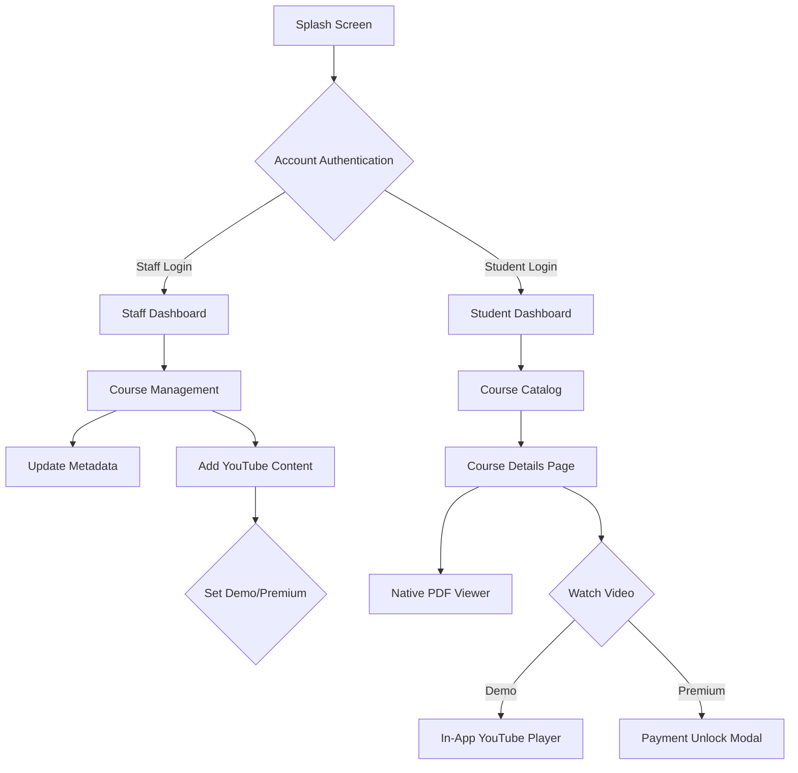

# 🌿 Vaagai App (வாகை)

<div align="center">
  
  
  
  
</div>

---

### 🔥 **Overview**
**Vaagai** is a premium, state-of-the-art educational application designed to bridge the gap between quality content creation and immersive student learning. Built with a focus on high-performance architecture and modern design aesthetics, Vaagai provides a seamless platform for both course administrators and eager learners.

---

### 🎨 **Key Features**

#### 👨‍🏫 **For Staff (Admin Module)**
- **Dynamic Course Management**: Real-time updates for titles, descriptions, and instructors.
- **Video Strategy**: Effortlessly add YouTube content with a single link.
- **Content Gating**: Toggle between **Demo (Free)** and **Premium (Full)** versions with one tap.
- **Image-First Design**: Hero image previews to ensure students see the best version of your content.

#### 🎓 **For Students**
- **In-App Theater**: Watch YouTube lessons natively without ever leaving the application.
- **Native PDF Rendering**: High-fidelity PDF document viewer built directly into the dashboard.
- **Progressive Discovery**: Browse professional course cards with clear status indicators (Free vs. Premium).
- **Unified Hub**: Access all materials, videos, and instructor info in one centralized view.

---

### 🛠️ **Technology Stack**
- **UI/UX**: Flutter (Material 3) with custom Glassmorphism and specialized cards.
- **Backend Service**: Firebase (Firestore, Authentication, Storage).
- **Video Engine**: `youtube_player_flutter` for native in-app integration.
- **Document Engine**: `syncfusion_flutter_pdfviewer`.
- **Cloud Storage**: Google Drive API integration for scalable document management.

---

### 📐 **Application Flow**



---

### 🚀 **Installation & Setup**

1. **Clone the repository**
   ```bash
   git clone https://github.com/Vinothkumar0311/Vaagai_app.git
   ```

2. **Install dependencies**
   ```bash
   flutter pub get
   ```

3. **Firebase Setup**
   Ensure your `google-services.json` is placed in the `android/app/` directory and configure your Firebase project.

4. **Run the App**
   ```bash
   flutter run
   ```

---

<div align="center">
  <p>Built with ❤️ by Vinoth for the Vaagai Community</p>
  <sub>Premium Learning. Simplified.</sub>
</div>
