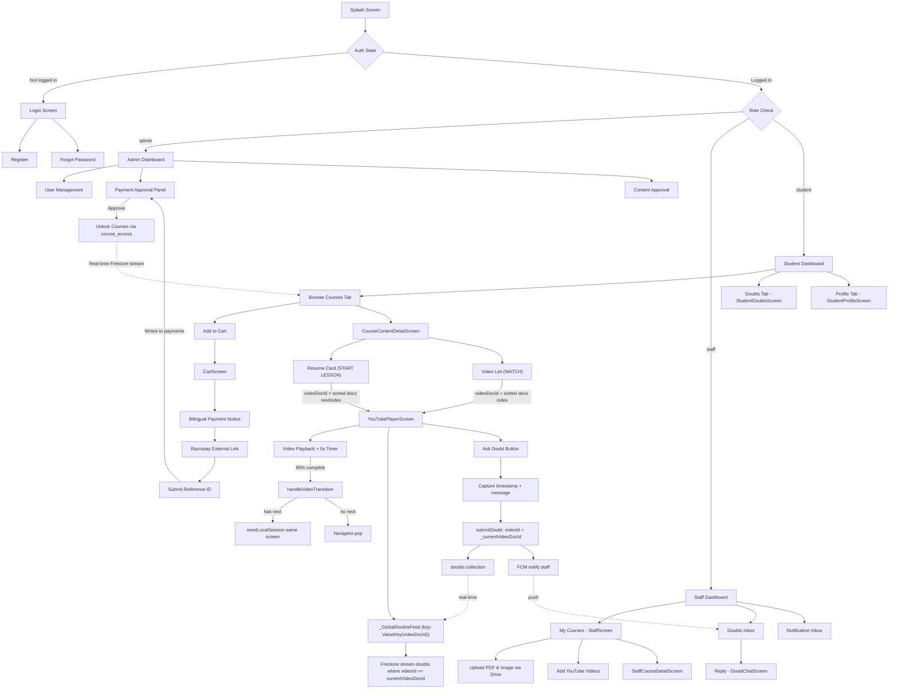

# 🌿 Vaagai App (வாகை)

<div align="center">
  
  
  
  
  
  
</div>

---

## 🔥 Overview

**Vaagai (வாகை)** is a premium cross-platform educational application built with **Flutter + Firebase**. It serves a three-role ecosystem — **Students**, **Staff (Instructors)**, and **Admins** — each with a dedicated dashboard and feature set.

- **Students** browse courses, track progress, submit doubts, and enroll via a Razorpay-integrated payment flow.
- **Staff** upload and manage video-based courses, respond to student doubts, and receive real-time FCM push notifications.
- **Admins** manage users, approve content, verify payments, and assign courses directly to students.

The architecture uses the **Provider** pattern for state management, **Cloud Firestore** as the real-time backend, and enforces a strict separation between UI views, providers, services, and data models. The app is constrained to a **450px max-width container** for a mobile-first experience across all platforms.

> **Note on Login**: Students enrolled by admin use their **Full Name** as username and their **mobile number** as password. This is enforced in `AuthService` and `LoginScreen`.

---

## 🗂️ Project Structure

```
lib/
├── core/
│   ├── constants/
│   │   ├── app_colors.dart          # Brand color palette
│   │   └── app_strings.dart         # Bilingual UI strings (Tamil + English)
│   ├── models/                      # Pure Firestore ↔ Dart data models
│   │   ├── app_models.dart          # UserModel, CourseModel, TopicModel, MaterialModel
│   │   ├── course_access_model.dart # CourseAccessModel, PaymentStatus enum
│   │   ├── course_progress_model.dart
│   │   ├── course_video_model.dart
│   │   ├── doubt_model.dart
│   │   ├── notification_model.dart
│   │   ├── payment_record_model.dart
│   │   └── uploaded_document.dart
│   ├── routes/
│   │   └── app_routes.dart          # Named route map & generateRoute()
│   ├── services/
│   │   └── (auth_service, etc.)
│   ├── theme/
│   └── utils/
│       └── drive_utils.dart         # Google Drive URL transformer
│
├── providers/                       # All ChangeNotifier providers (state layer)
│   ├── auth_provider.dart           # Firebase Auth + Firestore user fetch
│   ├── cart_provider.dart           # In-memory cart for course selection
│   ├── course_access_provider.dart  # Real-time course access/unlock records
│   ├── course_provider.dart         # Course CRUD & stream queries
│   ├── doubt_provider.dart          # Doubt submit, reply, status updates
│   ├── notification_provider.dart   # Unread notification stream
│   ├── payment_provider.dart        # Razorpay payment record management
│   └── progress_provider.dart       # Per-student video progress tracking
│
├── services/
│   ├── drive_upload_service.dart    # Google Drive file upload via Apps Script
│   └── notification_service.dart    # FCM push notification dispatcher
│
├── view/
│   ├── screens/
│   │   ├── admin_dashboard_screen.dart
│   │   ├── admin_payment_approval_screen.dart
│   │   ├── admin_video_approval_screen.dart
│   │   ├── analytics_course_list_screen.dart
│   │   ├── cart_screen.dart
│   │   ├── course_content_detail_screen.dart
│   │   ├── course_detail_screen.dart
│   │   ├── dashboard_screen.dart
│   │   ├── document_upload_screen.dart
│   │   ├── doubt_chat_screen.dart
│   │   ├── forgot_password_screen.dart
│   │   ├── login_screen.dart
│   │   ├── payment_registration_screen.dart
│   │   ├── pdf_viewer_screen.dart
│   │   ├── register_screen.dart
│   │   ├── role_selection_screen.dart
│   │   ├── staff_course_detail_screen.dart
│   │   ├── staff_dashboard_screen.dart
│   │   ├── staff_doubts_screen.dart
│   │   ├── staff_notification_inbox_screen.dart
│   │   ├── staff_screen.dart
│   │   ├── student_dashboard_screen.dart
│   │   ├── student_doubts_screen.dart
│   │   ├── student_profile_screen.dart
│   │   ├── user_management_screen.dart
│   │   └── youtube_player_screen.dart
│   └── widgets/
│       ├── course_widgets.dart       # StatusChip, CourseCard, etc.
│       └── dialogs.dart              # Reusable confirmation dialogs
│
├── firebase_options.dart
├── main.dart                         # App entry point + MultiProvider setup
└── splash_screen.dart
```

---

## 🧩 Firestore Data Structure

### `users` collection
```
users/{uid}
  ├── uid: String
  ├── name: String
  ├── email: String
  ├── role: "student" | "staff" | "admin"
  ├── phone: String?
  ├── whatsapp: String?
  ├── aadhar_number: String?
  └── fcmToken: String          # For push notifications
```

> **Admin-Assigned Enrollment**: When an admin admits a student, credentials are  
> `username = Full Name`, `password = mobile number`. The `AuthService`  
> handles name-based Firebase Auth lookup before signing in.

### `course_uploads` collection
```
course_uploads/{courseDocId}
  ├── title: String
  ├── objective: String
  ├── trainers: String           # Comma-separated trainer names
  ├── category: String
  ├── imageUrl: String           # Google Drive file URL
  ├── pdfUrl: String?            # Optional syllabus PDF
  ├── createdBy: String          # Staff UID (used for doubt notifications)
  ├── createdAt: Timestamp
  └── status: "approved" | "pending"
```

### `course_videos` collection
```
course_videos/{videoDocId}
  ├── courseDocId: String        # FK → course_uploads
  ├── title: String
  ├── youtubeUrl: String
  ├── isDemo: Boolean
  ├── status: "approved" | "pending"
  └── createdAt: Timestamp       # CRITICAL: Used for chronological sort order
```

> ⚠️ **IMPORTANT**: `createdAt` is the **only** source of truth for video order.  
> Always sort `course_videos` by `createdAt` ascending before indexing.  
> **Never** rely on raw Firestore snapshot order (non-deterministic).

### `course_progress` collection
```
course_progress/{docId}
  ├── student_id: String
  ├── course_id: String
  ├── completed_videos: List<String>     # Completed videoDocIds
  ├── completed_videos_count: int
  ├── last_video_id: String              # Current/next video pointer
  ├── last_timestamp: int                # Resume position in seconds
  ├── progress_percentage: double
  ├── total_videos: int
  └── updated_at: Timestamp
```

> ⚠️ **RULE**: `last_video_id` always points to the **currently-playing** or **next-to-watch** video.  
> After 90% completion, it advances to the next video's docId.  
> Periodic sync must **NOT** overwrite `last_video_id` if the video is already in `completed_videos`.

### `doubts` collection
```
doubts/{doubtDocId}
  ├── studentId: String
  ├── studentName: String
  ├── courseId: String
  ├── courseName: String
  ├── courseImage: String?
  ├── videoId: String            # ← Firestore videoDocId (NOT YouTube video ID)
  ├── videoTitle: String
  ├── timestampSeconds: int      # Exact second in video when doubt was raised
  ├── message: String
  ├── staffReply: String?
  ├── status: "pending" | "replied" | "closed"
  ├── createdAt: Timestamp
  └── repliedAt: Timestamp?
```

> ⚠️ **CRITICAL**: `videoId` must always equal the Firestore `course_videos` document ID —  
> **not** the YouTube video ID string (e.g. `dQw4w9WgXcQ`).

### `payments` collection
```
payments/{paymentDocId}
  ├── userId: String
  ├── userName: String
  ├── userEmail: String
  ├── courseIds: List<String>
  ├── courseItems: List<Map>       # [{courseId, courseTitle}]
  ├── amount: int                  # In INR
  ├── status: "pending" | "verification_pending" | "success" | "failed"
  ├── paymentLink: String          # Hosted Razorpay link
  ├── submittedPaymentRef: String  # Student-provided Reference ID
  ├── verifiedBy: String?          # Admin UID
  ├── createdAt: Timestamp
  └── updatedAt: Timestamp
```

### `course_access` collection
```
course_access/{accessDocId}
  ├── studentId: String
  ├── courseId: String
  ├── courseTitle: String
  ├── paymentStatus: "pending" | "approved" | "rejected"
  ├── accessEnabled: Boolean
  ├── paymentProofUrl: String?     # Screenshot link
  ├── approvedBy: String?          # Admin UID
  ├── rejectionReason: String?
  └── createdAt: Timestamp
```

### `notifications` collection
```
notifications/{notifId}
  ├── recipientUid: String
  ├── title: String
  ├── body: String
  ├── doubtId: String
  ├── is_read: Boolean
  └── createdAt: Timestamp
```

---

## 🎯 Role-Based Access Flow

```
Splash Screen
    │
    ▼
AuthProvider checks Firebase Auth state
    │
    ├─── Not logged in ──► Login Screen ──► Register / Forgot Password
    │
    └─── Logged in ──► Role check from Firestore users/{uid}.role
               │
               ├─── "admin"   ──► AdminDashboardScreen
               ├─── "staff"   ──► StaffDashboardScreen
               └─── "student" ──► StudentDashboardScreen
```

---

## 🎓 Student Dashboard & Navigation

The **StudentDashboardScreen** has 3 bottom-nav tabs:

| Index | Tab | Screen |
|-------|-----|--------|
| 0 | 📚 Courses | Course list with progress + cart + logout |
| 1 | 🔔 Notifications | `StudentDoubtsScreen` (doubt inbox) |
| 2 | 👤 Profile | `StudentProfileScreen` |

### Course Card States

| State | Button Label | Action |
|-------|-------------|--------|
| Locked, not in cart | ➕ Add to Cart | Adds course to `CartProvider` |
| In cart | 🛒 Go to Cart | Navigates to `CartScreen` |
| Pending payment | ⏳ Approval Pending | Opens `PaymentRegistrationScreen` |
| Access approved | ▶ Continue Watching / Access Material | Opens `CourseContentDetailScreen` |

Progress bar is shown inline on the card for enrolled students, pulling live data from `ProgressProvider`.

---

## 🛒 Enrollment Flow (Cart → Razorpay → Admin Approval)

```
StudentDashboardScreen
    │
    ├── Add to Cart ──► CartProvider (in-memory)
    │
    └── CartScreen
            │
            ├── Review & remove items
            └── REQUEST UNLOCK
                    │
                    ├── Bilingual popup (Tamil/English): "Capture your Payment ID"
                    ├── Redirect to Razorpay hosted payment link
                    └── PaymentRegistrationScreen
                            │
                            └── Student submits Reference ID
                                    │
                                    └── Writes to `payments` collection
                                            │
                                            └── Admin verifies in AdminPaymentApprovalScreen
                                                    │
                                                    └── Approves → course_access.accessEnabled = true
                                                            │
                                                            └── CourseAccessProvider stream instantly unlocks course card ✅
```

---

## 🎬 YouTube Player & Progress Tracking

### YouTubePlayerScreen Flow

```
YouTubePlayerScreen(videoUrl, title, courseId, videoDocId, startAt)
    │
    initState()
    ├── _extractVideoId()          ← strips YouTube video ID from URL
    ├── _initFlutterController()   ← mobile: youtube_player_flutter
    ├── _initIframeController()    ← web: youtube_player_iframe
    └── _startProgressSync()       ← 5-second timer
            │
            Every 5 seconds:
            ├── trackPlayedSecond()      ← records unique seconds watched
            ├── saveProgressLocally()    ← SharedPreferences cache
            ├── Check 90% completion → _handleVideoTransition()
            └── Every 2 min → _triggerCloudSync()

_handleVideoTransition()
    ├── _findNextVideo()           ← queries sorted course_videos
    ├── _triggerCloudSync(forceComplete: true, nextVideoId: next.id)
    └── nextVideo != null
            └── _resetLocalSession(nextVideoId, ...)  ← seamless in-place switch
        else
            └── Navigator.pop()    (all videos completed)
```

### 90% Completion Rule

The app uses **unique-seconds tracking** to prevent skipping to the end:

```dart
// Completion check — either method passes:
bool isTrulyCompleted = (watchedUniqueSeconds / totalDuration) >= 0.9;
bool durationReached  = (currentPosition   / totalDuration) >= 0.95;
```

### Cloud Sync Rules

| Condition | `last_video_id` written | `last_timestamp` written |
|-----------|------------------------|--------------------------|
| Video in progress (not completed) | current `videoDocId` | current position |
| Re-watching a completed video | **NOT updated** ✅ | **NOT updated** ✅ |
| Video just completed (90% rule) | **next video's docId** | `0` (reset) |
| No next video after completion | unchanged | unchanged |

> ⚠️ Always check `completed.contains(videoId)` before writing `last_video_id`.  
> Writing it on re-watch would **regress** the progress pointer.

---

## 💬 Doubt System

### Submission

```
Student in YouTubePlayerScreen
    │
    └── Taps "சந்தேகம் கேட்க (Ask a Doubt)"
            │
            ├── Captures current timestamp from player controller
            └── DoubtProvider.submitDoubt()
                    ├── Writes: videoId = _currentVideoDocId (Firestore doc ID)
                    │          timestampSeconds = <current position>
                    │          message = <student text>
                    └── NotificationService.sendNotification()
                            └── Looks up course.createdBy → FCM push to staff UID
```

### Doubt Feed — `_GlobalDoubtsFeed` (StatefulWidget)

```dart
_GlobalDoubtsFeed(
  key: ValueKey(_currentVideoDocId),   // Forces rebuild on video switch
  videoId: _currentVideoDocId,
)
```

> ✅ **KEY**: `key: ValueKey(_currentVideoDocId)` guarantees the Firestore  
> stream is destroyed and recreated on every video switch — never reused from a previous session.

### Staff Reply Flow

```
Staff receives FCM push notification
    └── Taps → DoubtChatScreen(doubtId)
            └── Staff types reply → DoubtProvider.replyToDoubt()
                    ├── updates doubts/{doubtId}.staffReply + status="replied"
                    └── Student sees reply instantly in StudentDoubtsScreen (real-time stream)
```

---

## 🔔 Notification Flow

```
Student submits doubt
    └── DoubtProvider.submitDoubt()
            ├── Writes to `doubts`
            ├── Fetches course_uploads/{courseId} → gets createdBy (staff UID)
            └── NotificationService.sendNotification()
                    ├── Reads FCM token from users/{staffUID}.fcmToken
                    └── POST to FCM API → push to staff device

Staff receives push
    └── Taps notification → navigates to DoubtChatScreen(doubtId)
```

---

## 👩‍💼 Staff Features

**StaffDashboardScreen** tabs:
- **My Courses** — stream of staff-owned `course_uploads`, direct into `StaffCourseDetailScreen`
- **Doubts Inbox** — `StaffDoubtsScreen`, real-time doubt feed
- **Notification Inbox** — `StaffNotificationInboxScreen`

**DocumentUploadScreen** allows staff to:
- Upload course image and PDF via **Google Drive (Apps Script)**
- Add / edit / delete YouTube video chapters

---

## 🛡️ Admin Features

**AdminDashboardScreen** tabs:
- **User Management** — `UserManagementScreen`: create, edit, deactivate students/staff
- **Payment Approval** — `AdminPaymentApprovalScreen`: verify Razorpay Reference IDs → approve/reject
- **Content Approval** — `AdminVideoApprovalScreen`: review pending courses & videos

---

## ⚡ Reactive Architecture & Real-Time Sync

The application uses a **Fully Reactive (Stream-Based)** architecture:

| Component | Mechanism | Benefit |
|-----------|-----------|---------|
| Staff Course List | `StreamBuilder` on `course_uploads` | New uploads appear instantly |
| Student Course List | `StreamBuilder` on `course_uploads` | Approved courses show immediately |
| Course Access / Lock Status | `CourseAccessProvider` live subscription | Lock → Watch without refresh |
| Progress Stats | `ProgressProvider` live subscription | Progress bars update in-session |
| Doubt Feed | Per-video Firestore stream in `_GlobalDoubtsFeed` | Always bound to current video |
| Notification Badge | `NotificationProvider` unread count stream | Live count updates |

---

## 📐 Full Application Flow Diagram



---

## ⚠️ Critical Implementation Rules

These rules prevent known bugs. Violating them will reintroduce issues.

### 1. Always Sort `course_videos` Before Indexing

```dart
// ✅ CORRECT
final docs = snapshot.data!.docs.toList();
docs.sort((a, b) {
  final aTime = (a.data() as Map)['createdAt'] as Timestamp?;
  final bTime = (b.data() as Map)['createdAt'] as Timestamp?;
  return (aTime ?? Timestamp(0, 0)).compareTo(bTime ?? Timestamp(0, 0));
});
```

### 2. `videoId` in Doubts = Firestore Document ID

Always use the `course_videos` document ID, **not** the YouTube video string.

### 3. Doubt Feed Must Be Keyed to `videoDocId`

```dart
_GlobalDoubtsFeed(
  key: ValueKey(_currentVideoDocId),
  videoId: _currentVideoDocId,
)
```

### 4. Never Regress `last_video_id` on Re-Watch

```dart
// ✅ CORRECT — only update pointer if video is not already completed
if (!completed.contains(videoId)) {
  updates['last_video_id'] = videoId;
  updates['last_timestamp'] = currentTimestamp;
}
```

### 5. Use `StreamBuilder` for Dashboard Lists

Prefer `streamAllCourses()` / `streamStaffCourses(uid)` over one-time fetch methods to prevent stale state.

### 6. `_GlobalDoubtsFeed` Must Remain a `StatefulWidget`

The stream must be owned and disposed by the widget's state. Do not convert to `StatelessWidget`.

### 7. `bulkCreate` Course Assignment

When assigning courses via admin bulk-create, do **not** combine `ignoreDuplicates: true` with `updateOnDuplicate`. Use one or the other to avoid Sequelize collisions.

---

## 🚀 Installation & Local Setup

### Prerequisites
- Flutter SDK `^3.5.0` (Dart `^3.5.0`)
- Firebase project with Firestore, Auth, Storage, Messaging, and App Check enabled

### Steps

1. **Clone the repository**
   ```bash
   git clone https://github.com/Vinothkumar0311/Vaagai_app.git
   cd vaagai_app
   ```

2. **Install dependencies**
   ```bash
   flutter pub get
   ```

3. **Firebase Configuration**
   - Android: place `google-services.json` in `android/app/`
   - iOS: place `GoogleService-Info.plist` in `ios/Runner/`
   - Web: Firebase config is embedded in `web/index.html`
   - Run: `flutterfire configure` if regenerating `firebase_options.dart`

4. **Google Drive Upload Service**
   - Deploy the Apps Script web app and set the URL in `DriveUploadService`
   - Place your service account JSON at `assets/service_account.json`

5. **Run the app**
   ```bash
   # Mobile (Android/iOS)
   flutter run

   # Web (Chrome)
   flutter run -d chrome

   # Windows Desktop
   flutter config --enable-windows-desktop
   flutter run -d windows
   ```

---

## 🤖 CI/CD — GitHub Actions

A GitHub Actions workflow (`.github/workflows/build_windows.yml`) automatically builds a **Windows desktop release** on every push to `main`/`master` or version tag push (`v*`):

- Builds with `flutter build windows --release`
- Packages output as `vaagai-windows-x64.zip`
- Uploads as a GitHub Actions artifact (7-day retention)
- On tag push → automatically creates a **GitHub Release** with the ZIP attached

---

## 📦 Key Dependencies

| Package | Version | Purpose |
|---------|---------|---------|
| `firebase_core` | `^3.13.1` | Firebase initialization |
| `cloud_firestore` | `^5.6.12` | Real-time Firestore database |
| `firebase_auth` | `^5.7.0` | Authentication |
| `firebase_storage` | `^12.4.10` | File storage |
| `firebase_messaging` | `^15.2.10` | FCM push notifications |
| `firebase_database` | `^11.3.10` | Firebase Realtime Database |
| `flutter_local_notifications` | `^18.0.1` | Foreground notification display |
| `provider` | `^6.1.5+1` | State management (ChangeNotifier) |
| `youtube_player_flutter` | `^9.1.0` | Native YouTube player (Mobile) |
| `youtube_player_iframe` | `^5.2.2` | iFrame YouTube player (Web) |
| `syncfusion_flutter_pdfviewer` | `^31.1.19` | Native PDF rendering |
| `shared_preferences` | `^2.2.3` | Local progress caching |
| `url_launcher` | `^6.3.2` | Open Razorpay payment links |
| `intl` | `^0.20.2` | Date & currency formatting |
| `image_picker` | `^1.2.1` | Camera / gallery image selection |
| `file_picker` | `^11.0.2` | Document file selection |
| `country_code_picker` | `^3.4.1` | International phone number input |
| `googleapis` / `googleapis_auth` | `any` | Google Drive API access |
| `http` | `^1.6.0` | HTTP client for FCM & Drive |
| `path_provider` | `^2.1.5` | Local file system paths |

---

## 🌍 Bilingual Support

All UI strings are maintained in `lib/core/constants/app_strings.dart` in both **Tamil (தமிழ்)** and **English**, ensuring accessibility for all students in the Vaagai community.

---

<div align="center">
  <p>Built with ❤️ by <strong>Vinothkumar</strong> for the <strong>Vaagai Community</strong></p>
  <sub>Premium Learning. Simplified. — வாகை கற்றல் தளம்</sub>
</div>
